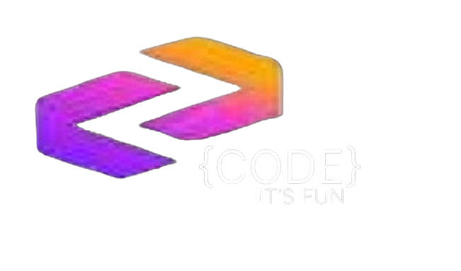

CODE-It-s-Fun is a Website that has front-end and backend using SQL. This website has developed in 2024. The website provides a variety of resources such as tutorials and examples to help users improve their understanding of programming concepts and syntax. The website is structured to offer a step-by-step approach to learning, starting from the basics and gradually advancing to more complex topics.

